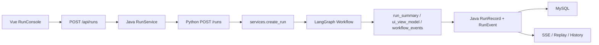
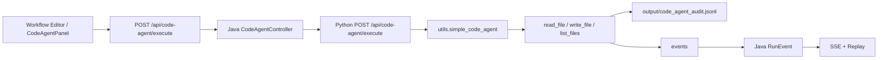
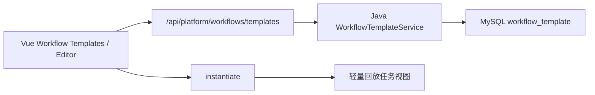

# v2-only 运行逻辑说明

当前分支已完成 v2-only 收敛：旧 Python UI / CLI 入口已删除，项目默认只维护 Vue -> Java -> FastAPI -> MySQL 平台演示链路。

## 主链路

```text
Vue3 前端
  -> Java Spring Boot Platform API
  -> Python FastAPI Agent Engine
  -> LangGraph / Agent / CodeAgent
  -> MySQL / JSONL / reports / runs / output
  -> Java RunEvent + SSE
  -> Vue 实时展示与 Replay
```

## 普通 Agent 工作流



## CodeAgent 文件操作链路



## Workflow 模板链路



## 推荐启动

Docker：

```powershell
docker compose up --build
```

本地：

```powershell
.\scripts\start_v2_local.ps1
```

## 当前 Compose 服务

- `mysql`
- `ai-agent-api`
- `backend-java`
- `frontend-vue`

## 保留模块

| 模块 | 原因 |
| --- | --- |
| `frontend-vue/` | v2 前端入口 |
| `backend-java/` | 平台 API、MySQL、SSE、Replay、模板管理 |
| `api_server.py` | Python Agent Engine API |
| `services/` | Python API 服务层 |
| `core/` | LangGraph 工作流核心 |
| `agents.py` / `agent_registry/` / `prompts/` | Agent 实现、元信息和 Prompt 模板 |
| `workflow_templates/` | 内置 Workflow 模板 |
| `plugins/` | 插件系统 |
| `utils/` | Runner、事件、报告、CodeAgent 工具 |
| `config/` | Python yaml 配置和 CodeAgent 策略 |
| `runner-cpp/` | 可选执行安全增强 |
| `scripts/` | v2 本地联调、smoke 和验收 |
| `reports/`、`runs/`、`output/` | 文件产物、运行状态和审计日志目录 |

## 已移除内容

- 旧 Python 页面入口。
- CLI 演示入口。
- Windows v1 安装和启动脚本。
- v1-only 发布、冻结和验收文档。
- 过时并行架构主文档。

## 最终验收

```powershell
.\scripts\smoke_codeagent.ps1 -ApiMode java -CheckBlockedPath
.\scripts\smoke_workflow_template.ps1
.\scripts\final_v2_acceptance.ps1
```
