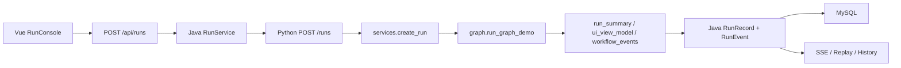
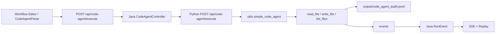
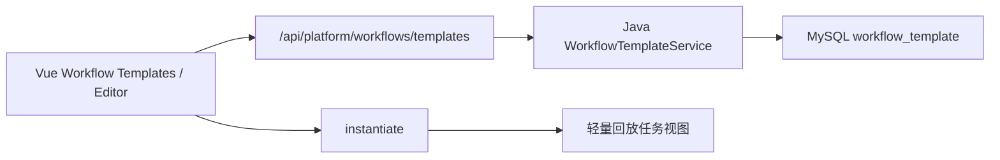

# v2-only 运行逻辑收敛说明

本文用于在 `codex/v2-only-remove-v1` 分支上执行 v1 去除前的运行逻辑梳理。当前阶段只做逻辑收敛和边界确认，不直接删除 v1 文件。

## 收敛目标

v2-only 后，项目应只保留一条主要演示和开发链路：

```text
Vue3 前端
  -> Java Spring Boot Platform API
  -> Python FastAPI Agent Engine
  -> LangGraph / Agent / CodeAgent
  -> MySQL / JSONL / reports / runs / output
  -> Java RunEvent + SSE
  -> Vue 实时展示与 Replay
```

核心原则：

- Vue 是唯一推荐前端入口。
- Java `/api` 是唯一推荐平台 API 入口。
- Python FastAPI 是内部 Agent Engine，不直接承担平台管理职责。
- MySQL 保存平台记录、配置、模板、事件和报告索引。
- `run_summary`、`ui_view_model`、`workflow_events` 继续作为跨层稳定契约。
- v1 文件在确认无依赖后再归档或删除。

## 当前运行链路

### 1. 普通 Agent 工作流



说明：

- Vue Java Gateway 模式调用 `POST /api/runs`。
- Java 生成 `platformRunId`，记录 RUN_CREATED、RUN_STARTED、PYTHON_REQUEST_SENT 等平台事件。
- Python 执行 LangGraph 工作流，返回 `run_id`、`state`、`run_summary`、`ui_view_model`。
- Java 保存运行记录、Python `workflow_events`、报告索引，并推送 SSE。

### 2. CodeAgent 文件操作链路



说明：

- CodeAgent 不是完整 Codex，只执行用户指定路径的受控文件操作。
- 路径策略来自 `config/settings.yaml` 中的 `code_agent.allowed_paths`、`blocked_paths` 和 `max_read_chars`。
- 审计日志写入 JSONL，事件进入 Java RunEvent，Vue 可实时展示和回放。

### 3. Workflow 模板链路



说明：

- Python 仍提供内置模板读取接口。
- Java 平台保存自定义模板、版本、删除状态和实例化记录。
- 当前模板实例化生成轻量任务视图，不直接改写 LangGraph 主流程。

### 4. 只读配置与平台数据链路

```text
Vue Dashboard / Models / Plugins / Agents / Reports
  -> Java Gateway
  -> MySQL 平台数据
  -> 必要时代理 Python FastAPI
```

说明：

- Models、Plugins、Settings 在 Java 模式优先使用 MySQL。
- Agents 通过 Java 代理 Python `/agents`。
- Reports 在平台视图优先使用 Java 报告索引，正文可代理 Python 报告文件。

## v2-only 推荐启动方式

### 本地开发

```powershell
.\scripts\start_v2_local.ps1
```

该脚本默认启动：

- Python FastAPI: `127.0.0.1:8001`
- 临时 MySQL: `127.0.0.1:3307`
- Java Gateway: `127.0.0.1:8088`
- Vue: `127.0.0.1:5174`

停止：

```powershell
.\scripts\stop_v2_local.ps1
```

### Docker

```powershell
docker compose up --build
```

v2-only 后，Compose 当前保留：

- `mysql`
- `ai-agent-api`
- `backend-java`
- `frontend-vue`

`streamlit-web` 已从 Compose 移除；`webui.py` 和 `graph_demo.py` 文件暂时不删。

## 保留模块

| 模块 | 原因 |
| --- | --- |
| `frontend-vue/` | v2 唯一前端入口 |
| `backend-java/` | 平台 API、MySQL、SSE、Replay、模板管理 |
| `api_server.py` | Python Agent Engine API 入口 |
| `services/` | Python API 服务层，不让 FastAPI 直接写复杂业务 |
| `schemas/` | Python API 请求响应结构 |
| `core/` | LangGraph 工作流核心 |
| `agents.py` / `agent_registry/` / `prompts/` | Agent 实现、元信息和 Prompt 模板 |
| `workflow_templates/` | 内置 Workflow 模板 |
| `plugins/` | 插件系统 |
| `utils/` | Runner、事件、报告、CodeAgent 等共享工具 |
| `config/` | Python yaml 配置和 CodeAgent 策略 |
| `runner-cpp/` | 可选执行安全增强 |
| `scripts/start_v2_local.ps1` 等 v2 脚本 | v2 本地联调和验收入口 |
| `reports/`、`runs/`、`output/` | 文件产物、运行状态和审计日志目录 |

## v1 去除候选

以下内容属于后续候选，当前文档阶段不直接删除：

| 候选 | 处理建议 |
| --- | --- |
| `webui.py` | v1 Streamlit 页面，v2-only 分支可归档或删除 |
| `graph_demo.py` | v1 CLI 演示入口，确认无测试依赖后归档或删除 |
| `main.py` | 早期 CLI pipeline，和 v2 主链路重复，需确认是否仍用于教学或演示 |
| `start_demo.bat` | v1 启动脚本，v2-only 后由 `scripts/start_v2_local.ps1` 替代 |
| `install.bat` | v1 安装辅助脚本，需确认是否仍作为 Windows 依赖安装入口 |
| `streamlit-web` Compose 服务 | 已从 v2-only Docker 中移除 |
| v1 冻结、验收、Streamlit 专属文档 | 建议移动到历史归档文档或保留为 legacy 说明 |

## 简化后的入口口径

| 场景 | 推荐入口 |
| --- | --- |
| 平台演示 | `http://127.0.0.1:5174` |
| 创建任务 | Vue `/runs/new` -> Java `POST /api/runs` |
| CodeAgent 演示 | Vue Workflow Editor / CodeAgentPanel -> Java `POST /api/code-agent/execute` |
| 历史记录 | Vue `/history` -> Java `/api/platform/runs` |
| 回放 | Vue `/replay/:platformRunId` -> Java `/api/platform/runs/{platformRunId}/replay` |
| 实时事件 | Java `/api/platform/runs/{platformRunId}/events/stream` |
| 配置管理 | Java `/api/settings`、MySQL 模型和插件配置 |
| Agent Engine 调试 | FastAPI Docs `http://127.0.0.1:8001/docs` |

## 下一步拆分建议

### Phase 1：文档和启动口径收敛

- README 默认推荐 v2 本地脚本和 Docker。
- 文档导航标记 v1 文档为 legacy。
- 保留 v1 文件但不作为默认入口。

### Phase 2：Docker v2-only

- 已从 `docker-compose.yml` 移除 `streamlit-web`。
- 保留 `ai-agent-api`、`backend-java`、`frontend-vue`、`mysql`。
- 验证 Docker 模式下 Vue -> Java -> Python -> MySQL。

### Phase 3：归档或删除 v1 入口

- 处理 `webui.py`、`graph_demo.py`、`main.py`、`start_demo.bat`。
- 如果用户希望保留历史，可移入 `legacy/v1-demo/`。
- 如果用户希望彻底 v2-only，可删除并更新文档。

### Phase 4：最终验证

建议执行：

```powershell
.\scripts\start_v2_local.ps1
.\scripts\smoke_codeagent.ps1 -ApiMode java -CheckBlockedPath
.\scripts\smoke_workflow_template.ps1
.\scripts\final_v2_acceptance.ps1
```

前端和后端构建验证：

```powershell
cd frontend-vue
npm run build
```

```powershell
cd backend-java
mvn -DskipTests package
```

## 决策点

执行删除前需要用户确认：

1. v1 文件是直接删除，还是移动到 `legacy/v1-demo/`。
2. README 是否完全去掉 v1 启动说明，还是保留 legacy 入口。
3. Docker Compose 已移除 `streamlit-web`，后续只需确认是否同步归档 v1 文件。
4. `main.py` 是否仍有教学、调试或答辩用途。
5. `install.bat` 是否由 v2 脚本完全替代。
